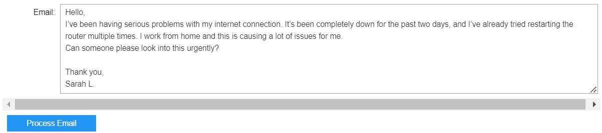
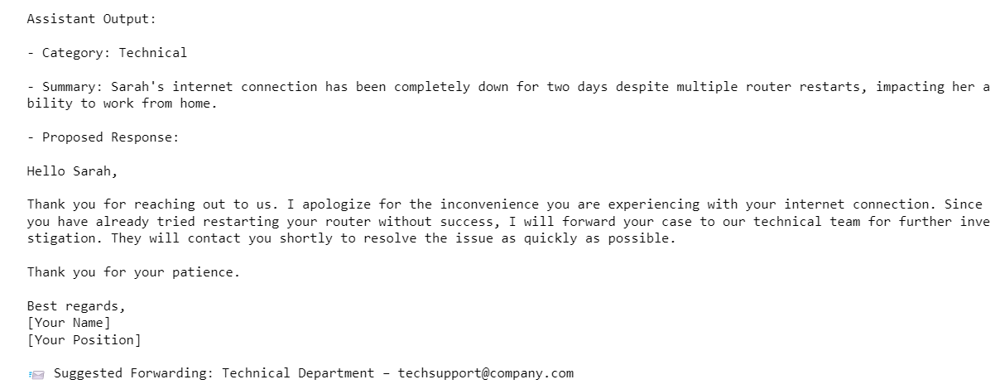

# AI-Powered Email Assistant for Telecom Support

🎓 **Bachelor’s Thesis – Experimental AI Email Responder**

This project was developed as part of my bachelor's thesis. The core objective was to explore whether artificial intelligence could generate responses to customer emails **faster than humans**, while maintaining the **same level of quality** and professionalism.

---

## 🧠 Purpose

The experiment aimed to evaluate how well AI (specifically OpenAI's GPT-4o model) could:

- Analyze customer emails in a telecom setting
- Identify the nature of the issue (billing, technical, complaint, etc.)
- Generate clear, polite, and professional responses
- Recommend forwarding to appropriate departments when needed

---

## 🚀 What I Learned

- How to integrate and work with the **OpenAI API**
- Building interactive user interfaces with **Jupyter Notebook** and `ipywidgets`
- Handling structured prompts for consistent AI outputs
- Categorizing AI responses and mapping them to real-world actions

---

## 🧰 Technologies Used

- Python 3.11+
- [OpenAI Python SDK](https://pypi.org/project/openai/)
- Jupyter Notebook
- `ipywidgets`

---

## 💡 How It Works

1. The assistant is prompted with a **structured system prompt** that includes rules for tone, professionalism, and response format.
2. You paste the **customer email** into a text field inside a Jupyter Notebook.
3. The assistant analyzes the message and returns:
   - **Category** of the issue (billing / technical / complaint / other)
   - A **Summary** of the message
   - A **Proposed Response** you can send back
4. If relevant, it suggests **forwarding** the email to the correct department (based on keyword detection).

This approach ensures consistent, polite, and effective responses to customer emails in a telecom environment.

---

## 🧪 Example Output

### 📨 Original Customer Email

---

### 🤖 AI-Generated Response

